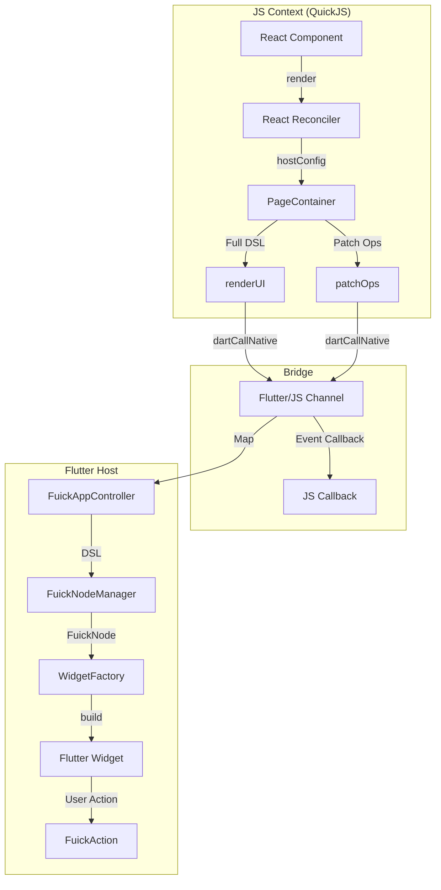

# FuickJS 渲染架构详解

FuickJS 是一个基于 React 和 Flutter 的动态化框架，它允许开发者使用标准的 React 语法（JSX/TSX）编写业务逻辑，并在 Flutter 端以原生 Widget 的形式进行渲染。

本文档将详细介绍 FuickJS 的端到端渲染流程，从 JS 代码的编写到最终 Flutter Widget 的上屏。

## 1. 系统架构概览

FuickJS 的核心架构可以分为三层：

1.  **生产者 (Producer)**: 运行在 QuickJS 中的 JS 框架层。利用 `react-reconciler` 将 React 组件树转换为 DSL (Domain Specific Language) 指令。
2.  **桥接层 (Bridge)**: 连接 JS 引擎与 Flutter 宿主的通道。负责高效地传输渲染指令 (Render/Patch) 和事件 (Event)。
3.  **消费者 (Consumer)**: Flutter 端的渲染引擎。接收 DSL 指令，维护节点树 (`FuickNodeTree`)，并将其映射为原生的 Flutter Widgets。



## 2. 第一层：JS 框架 (生产者)

JS 端是渲染流程的起点。它并不是运行在 WebView 中，而是运行在一个轻量级的 QuickJS 引擎中。

### 2.1 React Reconciler
FuickJS 实现了一个自定义的 React Renderer (位于 `fuick_js_framework/src/renderer.ts`)。当开发者调用 `render(<App />)` 时，React 开始构建虚拟 DOM 树。

*   **HostConfig**: `hostConfig.ts` 是 React 与宿主环境的适配器。它定义了如何创建实例 (`createInstance`)、如何追加子节点 (`appendChild`) 以及如何更新属性 (`commitUpdate`)。
*   **FuickNode**: 每个 React 组件（如 `<View>`, `<Text>`）在 JS 端都对应一个 `Node` 对象，它存储了当前的属性 (Props) 和子节点引用。

### 2.2 渲染模式
FuickJS 支持两种渲染模式，由 `PageContainer` 管理：

1.  **全量模式 (Dirty Mode)**:
    *   默认模式。
    *   当 React 树发生变化时，`PageContainer` 会遍历整棵树，生成一份完整的 JSON DSL。
    *   调用 `renderUI` 接口发送给 Flutter。
    *   *适用场景*: 页面初始化、结构发生剧烈变化。

2.  **增量模式 (Incremental Mode)**:
    *   优化模式（通过 `setIncrementalMode(true)` 开启）。
    *   `PageContainer` 收集具体的变更指令（如 `UPDATE`, `INSERT`, `REMOVE`）。
    *   指令被打包成扁平数组（OpCode Queue）。
    *   调用 `patchOps` 接口发送给 Flutter。
    *   *适用场景*: 长列表更新、频繁的局部状态变更。

## 3. 第二层：桥接层 (通信)

通信层负责 JS 与 Flutter 之间的数据交换。

### 3.1 JS -> Flutter
JS 通过全局函数 `dartCallNative` 调用 Flutter 能力：
*   `renderUI({ pageId, renderData })`: 发送全量页面数据。
*   `patchOps({ pageId, ops })`: 发送增量更新指令。
*   `console.log`: 转发日志到 Flutter 控制台。

### 3.2 Flutter -> JS
Flutter 通过 QuickJS 的 `invoke` 方法调用 JS 全局函数：
*   `dispatchEvent(eventObj, payload)`: 触发点击、输入等事件。
*   `getItemDSL(pageId, refId, index)`: 列表滚动时同步获取子项数据。

## 4. 第三层：Flutter 引擎 (消费者)

Flutter 端负责将接收到的数据还原为 UI。

### 4.1 控制器 (FuickAppController)
`FuickAppController` 是页面级的状态管理器。它监听来自 JS 的 `render` 和 `patch` 信号，并通知对应的 `FuickPageView` 进行刷新。

### 4.2 节点管理器 (FuickNodeManager)
这是 Flutter 端的“虚拟 DOM”管理器。
*   **创建**: 接收 JS 的 DSL Map，解析并创建 `FuickNode` 对象树。
*   **更新**:
    *   **全量**: 销毁旧树，重建新树。
    *   **增量**: 解析 `patchOps`，在现有的 `FuickNode` 树上进行增删改查。
*   **通知**: 当某个 `FuickNode` 更新时，它会通知订阅了该节点的 `FuickNodeWidget`（如果有）进行局部重绘。

### 4.3 组件工厂 (WidgetFactory)
`WidgetFactory` 是将 `FuickNode` 转换为 Flutter `Widget` 的核心组件。它维护了一个解析器注册表：

```dart
// app/lib/core/widgets/widget_factory.dart
register(ContainerParser());
register(TextParser());
register(ListViewParser());
// ...
```

每个 `WidgetParser` 负责处理一种类型的节点。例如 `ContainerParser` 会读取 `props['color']`, `props['padding']` 等属性，并构建出 Flutter 的 `Container` Widget。

## 5. 交互流程示例：点击按钮更新文本

1.  **用户点击**: 用户点击 Flutter 界面上的按钮。
2.  **事件捕获**: `GestureDetector` 捕获点击，调用 `FuickAction.event(context, onTapObj)`。
3.  **发送事件**: Flutter 通过 Bridge 调用 JS 的 `dispatchEvent`。
4.  **JS 处理**: JS 端的 `Renderer` 找到对应的回调函数并执行。
5.  **状态更新**: 回调函数中调用 `setState`，修改了组件状态（如 `count + 1`）。
6.  **React 更新**: React 触发 Re-render，计算出新的 Virtual DOM。
7.  **生成指令**: `PageContainer` 发现 Text 节点的 `text` 属性变了，生成 `UPDATE` 指令。
8.  **发送更新**: JS 调用 `dartCallNative('patchOps', ...)`。
9.  **应用更新**: Flutter 的 `FuickNodeManager` 接收指令，更新内存中的 `FuickNode`。
10. **UI 刷新**: 对应的 `FuickNodeWidget` 收到通知，重建 Flutter Widget 树，界面数字更新。

## 6. 核心文件索引

*   **JS 端**:
    *   [renderer.ts](file:///Users/wey/work/flutter_dynamic/fuickjs_pro/fuick_js_framework/src/renderer.ts): 渲染器入口，事件分发。
    *   [hostConfig.ts](file:///Users/wey/work/flutter_dynamic/fuickjs_pro/fuick_js_framework/src/hostConfig.ts): React 适配层，Diff 算法。
    *   [PageContainer.ts](file:///Users/wey/work/flutter_dynamic/fuickjs_pro/fuick_js_framework/src/PageContainer.ts): 页面容器，DSL 生成。

*   **Flutter 端**:
    *   [fuick_app_controller.dart](file:///Users/wey/work/flutter_dynamic/fuickjs_pro/app/lib/core/container/fuick_app_controller.dart): 消息总线。
    *   [fuick_node.dart](file:///Users/wey/work/flutter_dynamic/fuickjs_pro/app/lib/core/widgets/fuick_node.dart): 节点模型与更新逻辑。
    *   [widget_factory.dart](file:///Users/wey/work/flutter_dynamic/fuickjs_pro/app/lib/core/widgets/widget_factory.dart): Widget 构建工厂。
